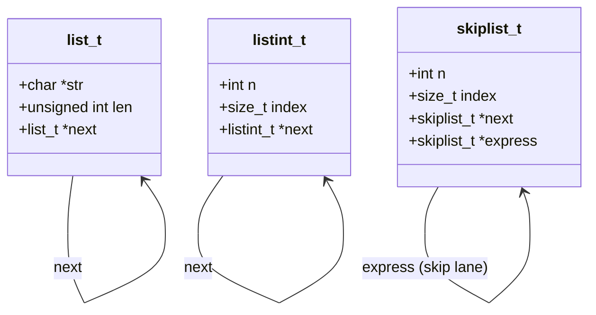

# ALX Low-Level Programming

A comprehensive collection of C programming exercises from the ALX Software Engineering program, progressing from "Hello, World" through pointers, memory management, data structures, and algorithm implementation — the foundational trimester covering how C, and by extension the computer, actually works.

  

## Features

- **C fundamentals** (`0x00`–`0x04`): "Hello, World", variables/conditionals/loops, functions, debugging exercises, nested loops
- **Pointers, arrays, and strings** (`0x05`): pointer arithmetic and custom string-handling functions
- **Recursion** (`0x08`): recursive implementations of common algorithms
- **Static libraries** (`0x09-static_libraries`): a hand-built C standard-library subset (string/memory/character functions), archived into `libmy.a` via `ar`, with a build script (`create_static_lib.sh`) that compiles all sources and packages them into a static library
- **Command-line arguments** (`0x0A-argc_argv`): parsing and using `argc`/`argv`
- **Dynamic memory** (`0x0B`, `0x0C-malloc_free`): custom `malloc`/`free`-based utilities (string duplication, 2D array allocation, etc.)
- **Preprocessor macros** (`0x0D`)
- **Structures and typedef** (`0x0E`): custom struct-based data types
- **Function pointers** (`0x0F`) and **variadic functions** (`0x10`)
- **Linked lists** (`0x12`, `0x13-singly_linked_lists`, `0x17-doubly_linked_lists`): custom `list_t` singly linked list with print/length/insert/free operations, and doubly linked list variants
- **Bit manipulation** (`0x14`)
- **File I/O** (`0x15`): low-level `open`/`read`/`write`/`close` file operations and a `cp` clone
- **Search algorithms** (`0x1E`): linear, binary, jump, interpolation, exponential, and advanced binary search, plus linked-list variants (`jump_list`, `linear_skip` on a skip list)

## Tech Stack

- C (compiled with `gcc`, following the Betty/Holberton coding style)
- `ar` for static library archiving
- Shell scripting for build automation
- x86 assembly (one exercise: `101-hello_holberton.asm`)

## Project Structure

```
0x00-hello_world/                First C programs
0x05-pointers_arrays_strings/    Pointer arithmetic, custom string functions
0x09-static_libraries/           Hand-built libc subset, packaged as libmy.a
0x0B-malloc_free/, 0x0C-more_malloc_free/   Custom dynamic memory utilities
0x0E-structures_typedef/         Custom struct data types
0x0F-function_pointers/          Function pointer exercises
0x12-singly_linked_lists/        list_t: singly linked list (lists.h)
0x13-more_singly_linked_lists/   Extended singly linked list operations
0x17-doubly_linked_lists/        Doubly linked list implementation
0x1E-search_algorithms/          Linear/binary/jump/interpolation/exponential search (search_algos.h)
```

## Architecture

The linked-list and search-algorithm projects define the repo's core data structures:



## Installation

```bash
git clone https://github.com/OmarElzero/alx-low_level_programming.git
cd alx-low_level_programming
```

Requires `gcc` and standard build tools. Each directory is compiled independently, following the pattern:

```bash
gcc -Wall -Wextra -Werror -pedantic -std=gnu89 *.c -o program
```

## Usage

Build and run the custom static library:

```bash
cd 0x09-static_libraries
./create_static_lib.sh
gcc -Wall -Wextra -Werror main.c liball.a -o a.out
./a.out
```

Build and run a search algorithm example:

```bash
cd 0x1E-search_algorithms
gcc -Wall -Wextra -Werror -pedantic -std=gnu89 1-binary.c 0-main.c -o binary
./binary
```

## Demo

No live demo is available for this project.

---

**Author:** OmarElzero · [GitHub](https://github.com/OmarElzero)
_Last updated: 2026-08-23_
